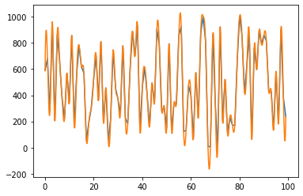
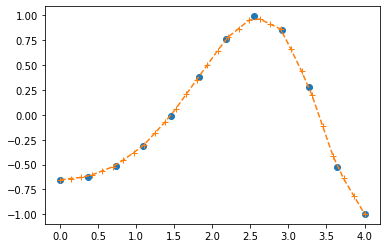

# How to interpolate using scipy


```python
import numpy as np
from scipy import interpolate
from matplotlib.pyplot import plot
%matplotlib inline
```


```python
nbrs = np.random.randint(0,1024, size=(100,))
plot(nbrs)

x = np.arange(0, nbrs.shape[0])

f = interpolate.interp1d(x, nbrs,kind = 'cubic')

xnew = np.linspace(0, nbrs.shape[0]-1, 1000)

plot(xnew, f(xnew))

```


    [<matplotlib.lines.Line2D at 0x7f833f6017f0>]





```python
import numpy as np
from scipy import interpolate

x = np.linspace(0, 4, 12)

y = np.cos(x**2/3+4)

f1 = interpolate.interp1d(x, y,kind = 'linear')
f2 = interpolate.interp1d(x, y, kind = 'cubic')

xnew = np.linspace(0, 4,30)

new_values1 = f1(xnew)
```


```python
import matplotlib.pyplot as plt
%matplotlib inline

plt.plot(x, y, "o")
plt.plot(xnew, new_values1, "+--")
```


    [<matplotlib.lines.Line2D at 0x7f833f3ce588>]




