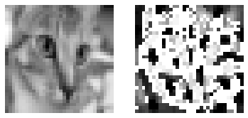

# How to read/write an image using skimage


```python
from skimage.data import chelsea
from skimage.io import imread, imsave
from matplotlib.pyplot import imshow, axis, subplot
import matplotlib.pyplot as plt
%matplotlib inline

im = chelsea()

im_path = "/tmp/chelsea.jpg"

imsave(im_path, im)

loaded_im = imread(im_path)

imshow(loaded_im)
axis("off")
```


    (-0.5, 450.5, 299.5, -0.5)




